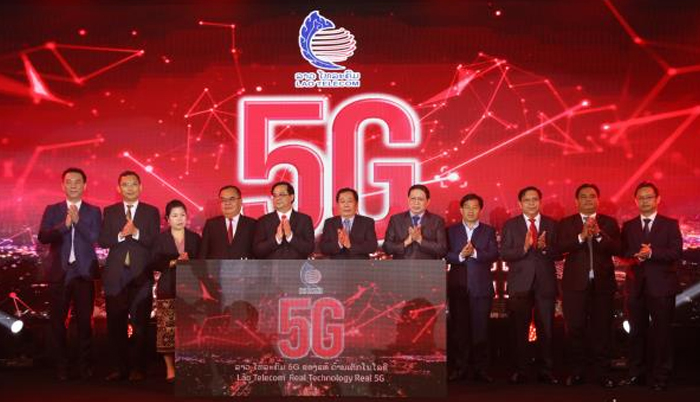

9월 1일 일본 니케이 신문에 따르면, 라오스가 중국의 테크 기업 화웨이의 기술을 도입한 5G 네트워크 서비스를 게시하겠다고 발표했다. UN이 지정한 "후발발전도상국" 중에서 5G를 도입한 나라는 라오스가 처음이라고 한다.

라오스에서 5G 기술을 도입하고 있는 라오텔레콤 (Lao Telecom)은 라오스에선 [두번째로 큰][lao-telecom] 통신기술회사다. 지난 10월 부터 중국의 화웨이에서 제공 받은 통신기술 및 인프라로 5G 기술 도입을 선도하고 있다고 한다.

이로서 라오스도 [태국][thailand], [필리핀][philippines]에 이어 중국발 기술을 적극 활용하여 5G 네트워크를 상용화하려는 동남아시아 국가의 반열에 들어섰다.

5G를 둘러싼 미중경쟁에서 동남아시아는 중국의 손을 들어주는 추세다. 2018년 말부터 트럼프 행정부는 전통적인 우방국들과 이외 국가들에게도 화웨이와 같은 중국 기업의 기술을 도입하여 5G 네트워크를 구축하는 것에 대해 경고한 바 있다. 하지만 태국도 필리핀도 트럼프와 폼페이오 국무장관의 [주의][warning]에도 꿋꿋이 중국과의 경협을 지속한 바 있다.

이는 화웨이 자체의 독자적인 승리라기보다는 중국의 친동남아 정책의 결실이라 보는게 옳다. 남중국해 분쟁과 같은 민감한 사안이 아직 해결되지 않았지만, 중국은 꾸준히 일대일로 (Belt and Road Initiative)나 아시아 인프라 투자 은행(Asia Infrastructure Investment Bank)과 같은 자국 주도의 다자간 프로젝트를 통해 러브콜을 보냈다. 중소국가들에 대한 꾸준한 투자가 지금과 같은 미중경쟁에서 중국이 부분적으로 우위를 점하는 계기가 된 것이다.

한국에서도 미중경쟁의 틈을 비집고 들어가 동남아의 5G 네트워크 시장 선점에 [열을 올리고 있다][korea-comp]. SK, KT, U플러스 트로이카가 중국의 입김이 덜한 곳에선 큰 활약을 하고 있다. 또 미국의 화웨이 금지 정책으로 삼성 스마트폰이 반사이익을 누리고 있는 시장도 있다.

하지만 대기업의 적극적인 단독 투자로 판세를 뒤집기는 힘들다. 화웨이나 5G는 지정학적 경쟁에서 우위를 점하기 위한 중국의 교두보 중 하나다. 인프라 및 외국인직접투자와 연계한 5G 네트워크 기술 경쟁에선 일관성 있는 정경협력 없이는 한국 기업들도 우위를 점하기가 힘들다.

게다가 한국은 결국 미국과 "같이 가는" 나라다. 미국의 영향력이 약세를 보이는 나라들에선 한국 역시도 힘을 쓰기가 힘들다.

5G 네트워크 경쟁은 기술 경쟁을 넘어 외교, 정치, 문화를 망라하는 종합적 지정학적 경쟁이다. 코로나 판데믹으로 인해 통신기술의 중요성이 각광받는 지금, 한국이 조금이라도 이득을 챙기기 위해선 대기업의 범위를 넘어서서 정부의 적극적 개입이 갖춰진 전략이 필요하다.

[lao-telecom]: https://halberdbastion.com/intelligence/mobile-networks/lao-telecom#:~:text=Lao%20Telecom%20is%20the%20second,(holding%2049%25%20ownership).
[thailand]:   https://asia.nikkei.com/Spotlight/5G-networks/Huawei-sweetens-5G-offer-in-Thailand-with-tech-training-center
[philippines]: https://asia.nikkei.com/Business/Telecommunication/Top-Philippine-telco-to-launch-5G-service-with-Huawei-and-Ericsson
[warning]: https://asia.nikkei.com/Business/Telecommunication/Top-Philippine-telco-to-launch-5G-service-with-Huawei-and-Ericsson
[korea-comp]: https://biz.chosun.com/site/data/html_dir/2020/04/10/2020041003549.html